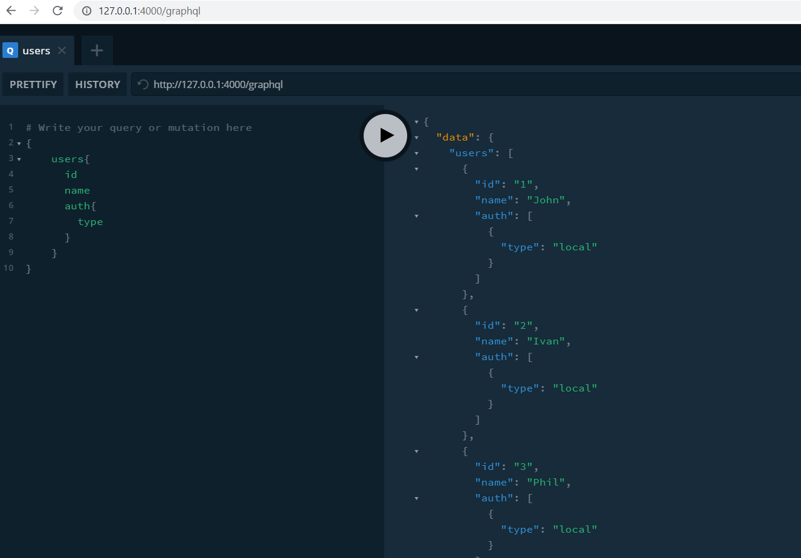

# GraphQL Sequelize NodeJS template

The Simple template to check GraphQL for NodeJS with Sequelize ORM and MySql in Docker

## Install 

```sh
docker-compose up -d
npx sequelize-cli db:migrate
npx sequelize-cli db:seed:all
```

## Start

```sh
npm run dev
```

## Chack API

http://127.0.0.1:4000/graphql




## Link to Article

https://medium.com/valtech-ch/setup-a-graphql-api-with-apollo-2-0-sequelize-and-express-js-608d1365d776